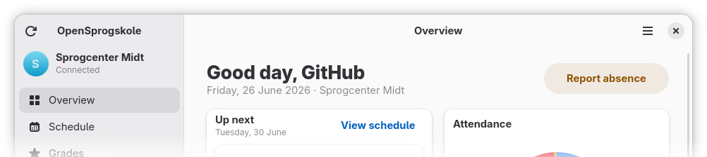

# ⚠️ This project is generated by an AI and published after manual review! See [note on AI](#use-of-generative-ai-and-llms) below!

---

<h1 align="center">OpenSprogskole</h1>
<h3 align="center">Your language school life</h3>

<p align="center"><i>Learning Danish at language school? This app is for you.</i></p>

---



OpenSprogskole is an application for Danish language schools, written in Vala and using GTK4 and libadwaita for its modern UI. It allows you to view your schedule, grades, homework and report when you are sick or unavailable.

Currently, the application supports the following language schools:

- [Sprogcenter Midt](https://sprogcentermidt.dk)

# Install

## From source

<details>
<summary>Dependencies</summary>

- `gio-2.0` >= 2.86
- `glib-2.0` >= 2.86
- `gtk-4` >= 4.22
- `json-glib-1.0` >= 1.10
- `libadwaita-1` >= 1.6
- `libsecret-1` ?
- `libsoup-3` >= 3.6
- `valac` ?

</details>

### GNOME Builder

- Clone
- Open in GNOME Builder
- Build

### Meson

```
meson setup build --prefix=$(PREFIX)
meson compile -C build
meson install -C build  #optional
```

# Use of Generative AI and LLMs

Unfortunately, this project was developed using the Claude Code agent and the Claude Opus 4.8 model. As a result, it is not recommended to use or contribute to this software, as AI-generated code may contain errors and potentially introduce copyright infringements, even when reviewed by experienced developers.

Starting from version 1.0, the use of AI-generated code in this repository is strictly prohibited. Please avoid using AI tools when reporting issues or submitting pull requests to this project.

The code in this repository was reviewed and tested by me, 000exploit. It was confirmed that modern LLMs can generate code that appears "fancy" and functional while containing numerous subtle issues and design flaws. This project is scheduled for a complete rewrite from scratch in a separate repository. A link to the new repository will be added once it reaches feature parity with the current implementation.
